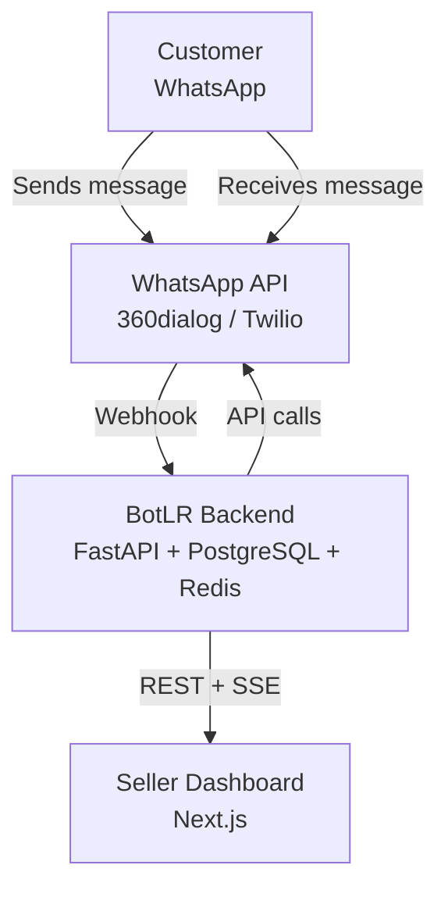
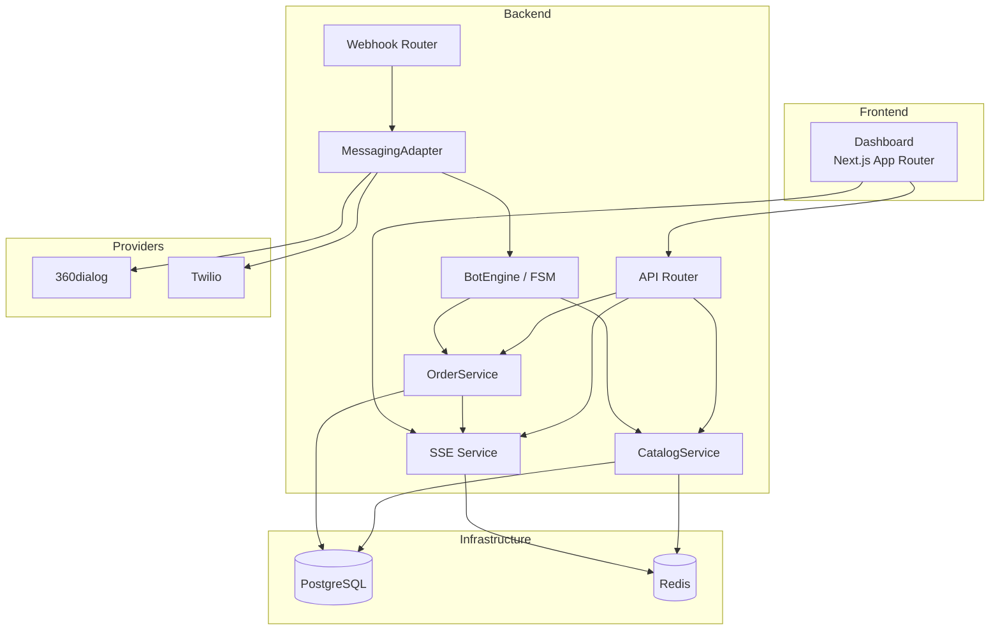
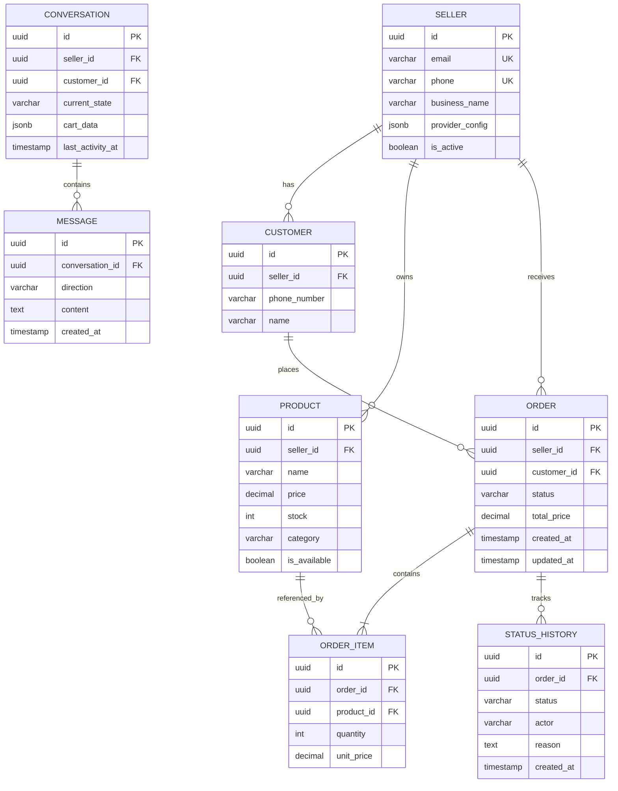
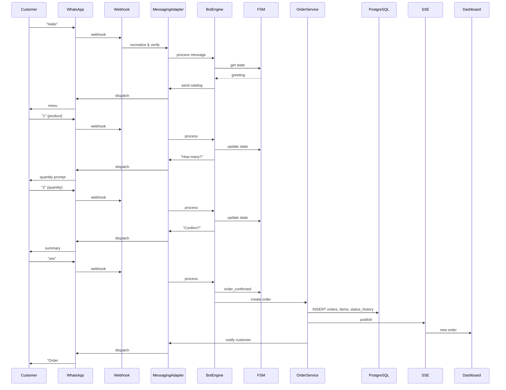
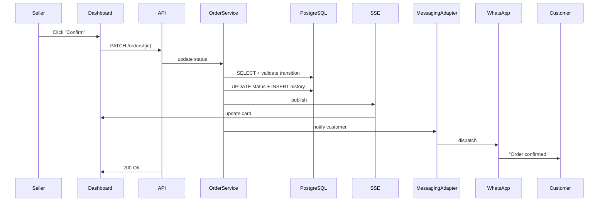

# BotLR Architecture

WhatsApp order-taking bot for small sellers. ~100 orders/day.

## Architecture Overview

BotLR uses **Hexagonal Architecture** (Ports & Adapters) to keep business logic isolated from frameworks and infrastructure.

**Why Hexagonal?** The bot must support multiple WhatsApp providers (360dialog, Twilio) without changing core logic. The architecture defines clear interfaces (Ports) that the domain code depends on, with concrete implementations (Adapters) plugged in at the edges. This makes the domain testable without FastAPI, PostgreSQL, or Redis, and allows swapping providers by implementing a single interface.

**Layers:**
- **Driving Adapters** (inbound): WhatsApp webhook handler, Dashboard REST API, SSE endpoint
- **Ports** (interfaces): `MessagePort`, `OrderPort`, `CatalogPort`, `SSEPort`, `MessagingProvider`, `StorageProvider`
- **Application/Domain**: BotEngine (FSM), OrderService, CatalogService
- **Driven Adapters** (outbound): 360dialog/Twilio providers, PostgreSQL repositories, Redis cache

## System Context Diagram

## Component Diagram

## Design Patterns

| Pattern | Where Applied | Why |
|---------|--------------|-----|
| **Strategy** | `MessagingProvider` interface with `WhatsApp360dialogProvider` and `TwilioProvider` | Swap providers without touching domain code |
| **State** | `ConversationFSM` for bot flow | Explicit transitions prevent invalid jumps (e.g., `greeting` → `order_confirmed`) |
| **Repository** | `OrderRepository`, `ProductRepository`, `ConversationRepository` | Domain remains persistence-agnostic; test with in-memory fakes |
| **Observer** | `SSEService` subscribes to `OrderService` events | Decouples event source from consumers (dashboard, logging) |
| **Factory** | `MessagingProviderFactory` resolves provider per seller | Each seller may use a different provider; creation logic centralized |
| **Dependency Injection** | FastAPI `Depends` for services and repositories | Endpoints are pure functions; test with mocked dependencies |

## Data Model

## Sequence Diagrams

### Customer Places Order

### Seller Confirms Order

## Architecture Decision Records

| Decision | Options Considered | Chosen | Why |
|----------|-------------------|--------|-----|
| Architecture | MVC, Layered, Hexagonal | Hexagonal | Provider swapping, testability, framework independence |
| Backend Framework | Django, Flask, FastAPI | FastAPI | Native async, auto OpenAPI, DI via `Depends` |
| Frontend Framework | CRA, Vue/Nuxt, Next.js | Next.js App Router | SSR, server components, strong TS support |
| Real-time Transport | WebSockets, Long Polling, SSE | SSE | Unidirectional push; native HTTP/2; simpler than WebSockets |
| Primary Database | MongoDB, SQLite, MySQL, PostgreSQL | PostgreSQL | ACID orders, JSONB for flexible metadata, mature ecosystem |
| Cache / State | Memcached, Redis | Redis | Cache, Pub/Sub, and conversation state in one store |
| Multi-tenancy | Schema-per-tenant, DB-per-tenant, row-level | Row-level (`seller_id`) | Simple ops, single migration path, sufficient for 50 sellers |
| WhatsApp Providers | Meta Cloud API, on-premise, unofficial | 360dialog / Twilio | Official APIs, no infra overhead, abstracted via adapter |

## Multi-Tenancy

Row-level isolation via `seller_id` foreign keys on every entity. Each query is scoped by `seller_id`; JWT tokens embed the `seller_id` claim; Redis keys are prefixed with `seller:{seller_id}:`. Webhooks are routed to the correct seller by phone number or API key before processing. This supports 50 sellers on a single instance with minimal operational overhead.

## Security

- **Auth**: JWT (HS256) with 30-minute expiry; `seller_id` claim enforced on every endpoint
- **Webhooks**: Provider signature verification (Twilio `X-Twilio-Signature`, 360dialog API key)
- **Input**: Pydantic validation on all inbound requests; parameterized queries only
- **Images**: Max 5 MB, JPEG/PNG/WebP whitelist, file type validation via magic numbers
- **Secrets**: Provider API keys encrypted at rest (AES-256); never logged
- **Rate limits**: Webhooks 10 req/sec global; API 100 req/min per seller; login 5 failures/15 min per IP
- **Audit**: All order status changes to immutable `status_history`; structured JSON logging

---

*End of Architecture Documentation*
